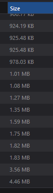
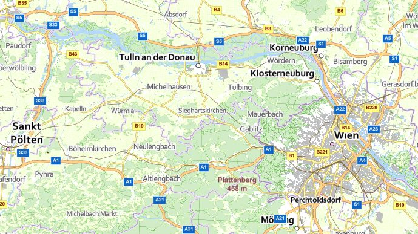
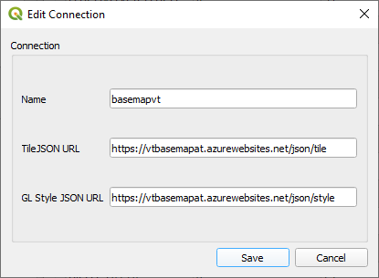
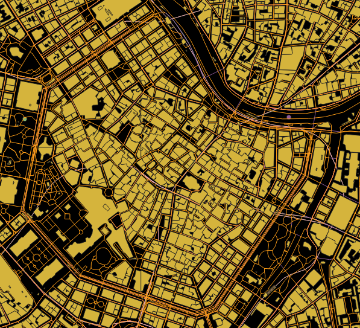
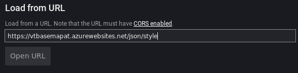
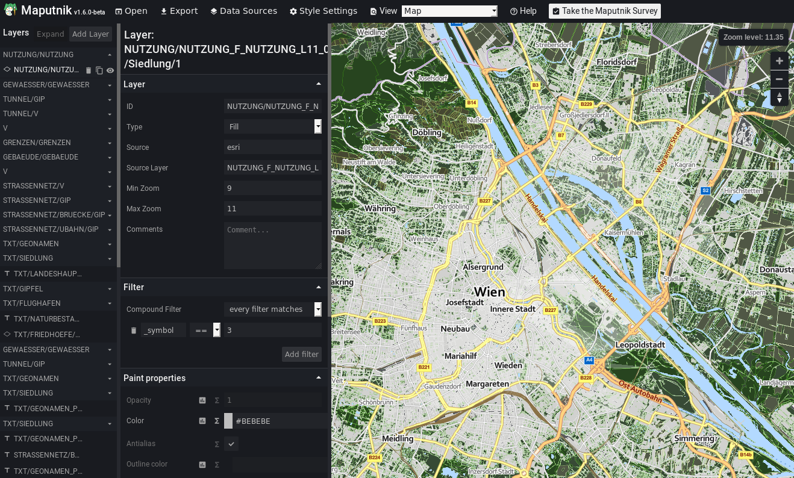

# basemap.at for Mapbox GL JS, QGIS, maputnik, ...

## basemap.at Verwaltungsgrundkarte Vektor Österreich

`basemap.at Vektor` is available:
* offline as ESRI VTPK [https://www.data.gv.at/katalog/dataset/b694010f-992a-4d8e-b4ab-b20d0f037ff0](https://www.data.gv.at/katalog/dataset/b694010f-992a-4d8e-b4ab-b20d0f037ff0)
* online as ESRI Vector Tile Cache [https://www.data.gv.at/katalog/dataset/a73befc7-575f-48cb-8eb9-b05172a8c9e3](https://www.data.gv.at/katalog/dataset/a73befc7-575f-48cb-8eb9-b05172a8c9e3)

**As far as I know there is no way to use it with any tools except ArcGIS Pro**

## Make it work

_**Disclaimer:**_ tiles have not been changed nor are they hosted as a shadow copy somewhere else. They are served directly from `https://maps.wien.gv.at`.

#### [Click here for an example map](map.html) using [Mapbox GL JS](https://docs.mapbox.com/mapbox-gl-js/overview/).

**_Be patient_, loading might take a while (at all times) as some tiles are a bit on the heavier side:**




Depending on which software is used, one or both of these are neeed:

* `style.json` : `https://vtbasemapat.azurewebsites.net/json/style`
* `tile.json` : `https://vtbasemapat.azurewebsites.net/json/tile`

### Make it work - Mapbox GL JS

Make sure to replace `<YOUR-TOKEN-GOES-HERE>` with your actual token.

```html
<!DOCTYPE html>
<html>
<head>
    <meta charset='utf-8' />
    <title>basemap.at vector with Mapbox GL Js</title>
    <meta name='viewport' content='initial-scale=1,maximum-scale=1,user-scalable=no' />
    <script src='https://api.tiles.mapbox.com/mapbox-gl-js/v1.2.0/mapbox-gl.js'></script>
    <link href='https://api.tiles.mapbox.com/mapbox-gl-js/v1.2.0/mapbox-gl.css' rel='stylesheet' />
    <style>
        body {margin: 0;padding: 0;}
        #map {position: absolute;top: 0;bottom: 0;width: 100%;}
    </style>
</head>
<body>

    <div id='map'></div>
    <script>
        mapboxgl.accessToken = '<YOUR-TOKEN-GOES-HERE>';
        var map = new mapboxgl.Map({
            container: 'map', // container id
            style: 'https://vtbasemapat.azurewebsites.net/json/style', // stylesheet location
            center: [16, 48], // starting position [lng, lat]
            zoom: 9 // starting zoom
        });
    </script>

</body>
</html>
```




## Make it work - QGIS

Use the [Vector Tiles Reader](https://plugins.qgis.org/plugins/vector_tiles_reader/) plugin.

Styling seems a bit wonky, but it is yet to be determined why: my internet connection, delivery of tiles, the generated `style.json`, ...

Sometimes I had to remove the layers and add them again.






## Make it work - maputik

Create your own stlyes with [maputnik](https://maputnik.github.io/):

* Click `Open`
* Paste the style URL into `Load from URL`
* Click `Open Url`




